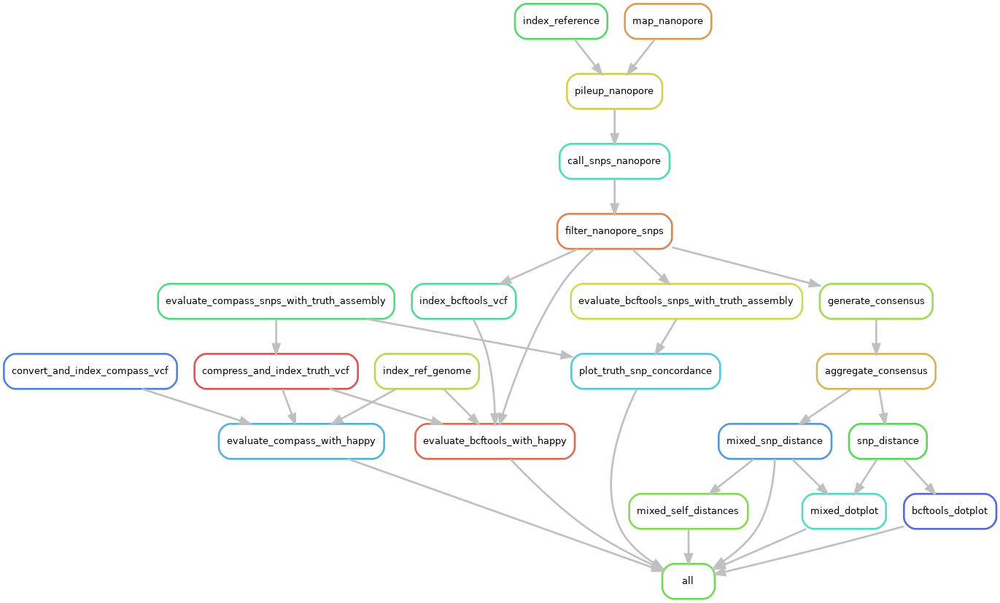

[TOC]: #

## Table of Contents
- [Pipeline overview](#pipeline-overview)
- [Methods](#methods)
  - [Illumina variant calls](#illumina-variant-calls)
  - [Nanopore variant calls](#nanopore-variant-calls)
  - [Filter Nanopore SNPs](#filter-nanopore-snps)
  - [Truth evaluation with `varifier` and `hap.py`](#truth-evaluation-with-varifier-and-happy)
  - [Comparing SNP distances from Illumina and Nanopore](#comparing-snp-distances-from-illumina-and-nanopore)
- [Results](#results)
  - [Truth evaluation](#truth-evaluation)
  - [Distance](#distance)

## Pipeline overview

## Methods

### Illumina variant calls

Variant calls for the Illumina data were done using the Public Health England pipeline
[compass]. This step is not included in the pipeline as it was run by Fan Yang-Turner of
the Nuffield Department of Medicine, University of Oxford. See [#17][17] and [#36][36]
for more information.

### Nanopore variant calls

Nanopore variants (SNPs) were called using [`bcftools`][bcftools] (v1.13). See the rules
within [`Snakefile`][Snakefile] for the parameters used.

### Filter Nanopore SNPs

`bcftools` SNP calls were filtered using
[`apply_filters.py`](./scripts/apply_filters.py). The parameters for this step can be
found in `config.yaml`. The choice of filters was tightly linked to evaluation of the
results from the [truth evaluation](#truth-evaluation). A detailed view of how the final
filters were selected can be seen in [this notebook](truth_eval/bcftools_filters.ipynb).

### Truth evaluation with `varifier` and `hap.py`

An unbiased view of how correct the variant calls for each sequencing technology are.

For the samples with good PacBio data, [`varifier`][varifier] was used to generate a
truth VCF for both the Illumina and Nanopore data. These
[PacBio CCS assemblies](../assembly) are considered "truth" and provide the best
feedback method for fine-tuning the Nanopore filters, and also for highlight the
differences/similarities in variant calls from Illumina and Nanopore reads. We used
[`hap.py`](https://github.com/Illumina/hap.py) to evaluate the variant calls for each
sample against the truth VCF.

### Comparing SNP distances from Illumina and Nanopore

The first step here was to generate a consensus sequence for each VCF file using
[`consensus.py`](./scripts/consensus.py). The rule `generate_consensus` outlines the
parameters etc. used to run this section. Discussion of the choice of parameters can be
found in [#41][41].  
When generating the consensus sequence, we effectively "mask" (replace reference base
with 'N') any positions that is in the mask, fails filters, is heterozygous, missing in
VCF, or is a null call.  
The pairwise SNP distance matrix was produced using [`psdm`][psdm].

## Results

The [report] contains results for the following parts of this analysis.

### Truth evaluation

In this section of the [report], there is a plot of the precision and recall of the
compass and `bcftools` SNP calls.

### Distance

This section of the [report] contains a heatmap for both compass and `bcftools` distance
matrices. It also contains a scatter plot of the pairwise SNP distance from compass
(x-axis) against the distance for the same pair from `bcftools` (y-axis).

[17]: https://github.com/mbhall88/head_to_head_pipeline/issues/17
[36]: https://github.com/mbhall88/head_to_head_pipeline/issues/36
[41]: https://github.com/mbhall88/head_to_head_pipeline/issues/41
[bcftools]: https://samtools.github.io/bcftools/bcftools.html
[compass]: https://github.com/oxfordmmm/CompassCompact
[psdm]: https://github.com/mbhall88/psdm
[report]: ./report.html
[varifier]: https://github.com/iqbal-lab-org/varifier

